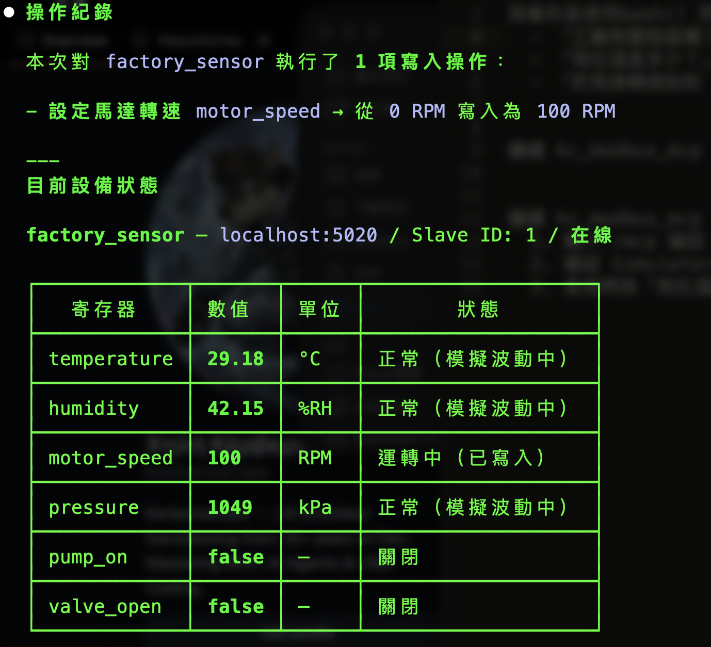

# "Read the factory temperature" -- Modbus MCP

[](LICENSE)
[](https://python.org)
[](https://github.com/jlowin/fastmcp)
[](https://modelcontextprotocol.io)

[正體中文](README_zh.md)

Look, nobody wants to memorize that register `40001` is the temperature sensor. Life is too short and Modbus addresses are too many. This is an MCP Server for Modbus TCP devices -- you define device profiles in YAML, and then AI agents can read/write PLC registers by name like civilized beings.

It also ships with a **built-in simulator**, because we all know you don't have a PLC sitting on your desk. (And if you do, please dust it off.)

---

## Why This Exists

I kept looking at existing MCP servers for Modbus and kept finding the same four disappointments:

1. **No semantic register mapping** -- the AI has to know raw addresses like `40001`. Asking it to "read temperature" gets you a blank stare.
2. **No data type conversion** -- everything comes back as raw uint16, because apparently float32 is too fancy.
3. **No built-in simulator** -- want to test? Go buy hardware. Or beg a colleague. Or stare at the ceiling.
4. **No device profiles** -- no way to pre-configure connection details and register maps, so you get to type the same host/port/slave_id over and over like it's 1998.

So I did the unreasonable thing and fixed all four myself.

---

## Architecture

```
User (CLI / Chat / OpenClaw)
  → AI Agent (Claude / OpenClaw / etc.)
    → MCP Protocol (Streamable HTTP)
      → kc_modbus_mcp (FastMCP Server)
        → Profile Manager (YAML device profiles)
        → pymodbus (async Modbus TCP client)
      → Modbus TCP Device / Built-in Simulator
```

## Features

- **Natural language control** -- "read the factory temperature" just works. No address lookup tables taped to your monitor.
- **YAML device profiles** -- map register names to addresses, data types, units, and scaling. Finally, configuration that reads like English.
- **8 MCP tools** -- 5 profile-based + 3 raw mode for when you need to go full hacker.
- **Auto data type conversion** -- float32, int32, uint16, bool -- with byte order and scale support, because doing bit math in your head at 2 AM is not a personality trait.
- **Built-in Modbus TCP simulator** -- sine-wave temperature, random humidity/pressure, writable coils. Your imaginary factory is doing great.
- **Docker-ready** -- `docker compose up -d` and you're in business. Two containers, zero excuses.
- **OpenClaw skill** -- wrapper script for local LLM agents who prefer the command line lifestyle.

---

## Demo



---

> **Security Notice:** This is a POC/development project designed for trusted LAN environments. The MCP server does not implement authentication. Raw mode allows read/write access to any reachable Modbus device. Do not expose service ports to the public internet without additional security measures.

## Quick Start

Three terminals, five minutes, zero soldering required.

### 1. Clone and install

```bash
git clone https://github.com/KerberosClaw/kc_modbus_mcp.git
cd kc_modbus_mcp
uv sync
```

### 2. Start the simulator

```bash
uv run python simulator.py
# Modbus TCP simulator running on port 5020
```

### 3. Start the MCP server

```bash
# In another terminal
uv run python server.py
# MCP server running on port 8765, loaded devices.yaml
```

### 4. Test with MCP client

```bash
npm install -g mcporter
mcporter config add modbus --url http://localhost:8765/mcp
mcporter call modbus.list_devices
mcporter call modbus.read_device device=factory_sensor register=temperature
mcporter call modbus.write_device device=factory_sensor register=motor_speed value=1500
mcporter call modbus.device_status device=factory_sensor
```

### Or use Docker Compose

For the "I don't want to open three terminals" crowd (understandable):

```bash
docker compose up -d
# Simulator on :5020, MCP server on :8765
```

---

## Device Profile (YAML)

This is where the magic happens. Well, "magic" is generous -- it's just YAML. But it beats memorizing hex addresses. Define your Modbus devices in `devices.yaml`:

```yaml
devices:
  factory_sensor:
    host: 192.168.1.100
    port: 502
    slave_id: 1
    byte_order: big               # big | little | mixed
    registers:
      temperature:
        address: 0
        function_code: 3          # 3=holding, 4=input
        data_type: float32        # uint16, int16, uint32, int32, float32, bool
        scale: 0.1
        unit: "°C"
        access: read
        description: "Ambient temperature sensor"
      motor_speed:
        address: 4
        function_code: 3
        data_type: uint16
        unit: "RPM"
        access: read_write
        description: "Motor speed setpoint"
      pump_on:
        address: 0
        function_code: 1          # 1=coil
        data_type: bool
        access: read_write
        description: "Pump on/off switch"
```

### Supported Data Types

| Type | Registers | Range |
|------|-----------|-------|
| `bool` | coil (1 bit) | true/false |
| `uint16` | 1 | 0 – 65535 |
| `int16` | 1 | -32768 – 32767 |
| `uint32` | 2 | 0 – 4294967295 |
| `int32` | 2 | -2147483648 – 2147483647 |
| `float32` | 2 | IEEE 754 |

### Supported Function Codes

| Code | Name | Access |
|------|------|--------|
| 1 | Read Coils | read |
| 2 | Read Discrete Inputs | read |
| 3 | Read Holding Registers | read/write |
| 4 | Read Input Registers | read |

---

## MCP Tools

### Profile Mode (primary)

The user-friendly stuff. The reason this project exists.

| Tool | Description |
|------|-------------|
| `list_devices` | List all configured devices |
| `list_registers` | List all registers of a device with metadata |
| `read_device` | Read a named register -- returns converted value + unit |
| `write_device` | Write a value to a named register |
| `device_status` | Check if a device is online |

### Raw Mode (advanced)

For when you need to bypass all that nice abstraction and talk to registers like it's a bare metal Tuesday.

| Tool | Description |
|------|-------------|
| `read_registers` | Raw read by host/port/slave_id/fc/address |
| `write_registers` | Raw write by host/port/slave_id/fc/address |
| `scan_registers` | Scan address range for non-zero values |

---

## Built-in Simulator

A pymodbus-based Modbus TCP server that pretends to be a factory. The data is fake but the protocol is real. No hardware needed -- your laptop is the factory now.

| Register | Address | FC | Type | Behavior |
|----------|---------|-----|------|----------|
| temperature | HR 0-1 | 3 | float32 | Sine wave 20~30°C |
| humidity | HR 2-3 | 3 | float32 | Random 40~60%RH |
| motor_speed | HR 4 | 3 | uint16 | Holds written value |
| pressure | IR 0 | 4 | uint16 | Random 900~1100 kPa |
| pump_on | Coil 0 | 1 | bool | Holds written value |
| valve_open | Coil 1 | 1 | bool | Holds written value |

---

## Project Structure

```
kc_modbus_mcp/
├── server.py               # MCP Server entry point
├── simulator.py            # Built-in Modbus TCP simulator
├── devices.yaml            # Example device profile
├── src/
│   ├── profile.py          # YAML profile loader + register resolver
│   ├── client.py           # pymodbus async client wrapper
│   ├── converter.py        # Data type conversion (raw ↔ engineering value)
│   └── tools.py            # MCP tool definitions
├── openclaw-skill/         # OpenClaw skill wrapper
├── tests/                  # Automated tests
├── docker-compose.yml
├── Dockerfile
├── pyproject.toml
├── DESIGN.md               # Design document (Chinese)
├── .env.example
└── LICENSE
```

---

## Environment Variables

Sensible defaults included, because nobody should have to configure things just to see if they work.

| Variable | Default | Description |
|----------|---------|-------------|
| `MODBUS_PROFILE` | `devices.yaml` | Path to device profile YAML |
| `MCP_HOST` | `0.0.0.0` | MCP server bind address |
| `MCP_PORT` | `8765` | MCP server port |
| `SIMULATOR_HOST` | `0.0.0.0` | Simulator bind address |
| `SIMULATOR_PORT` | `5020` | Simulator port |

---

## OpenClaw Integration

For OpenClaw / local LLM agents, a wrapper script turns verbose MCP calls into something you can actually type without getting carpal tunnel:

```bash
modbus list
modbus status factory_sensor
modbus read factory_sensor temperature
modbus write factory_sensor motor_speed 1500
```

See [`openclaw-skill/SKILL.md`](openclaw-skill/SKILL.md) for details.

---

## TODO

Things I will definitely get to. Eventually. Probably.

- [ ] Multi-device connection pooling
- [ ] Polling mode with configurable cache interval
- [ ] Change detection (notify on value changes)
- [ ] Modbus RTU (Serial) support
- [ ] Web UI for device profile editing

---
